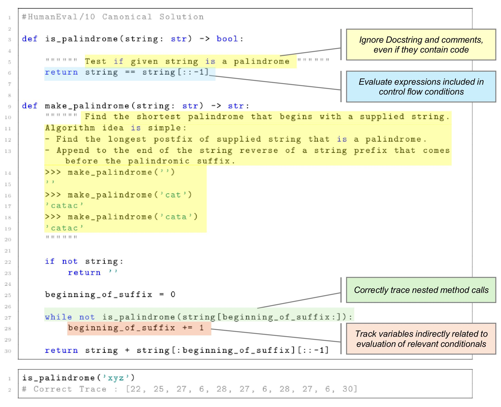
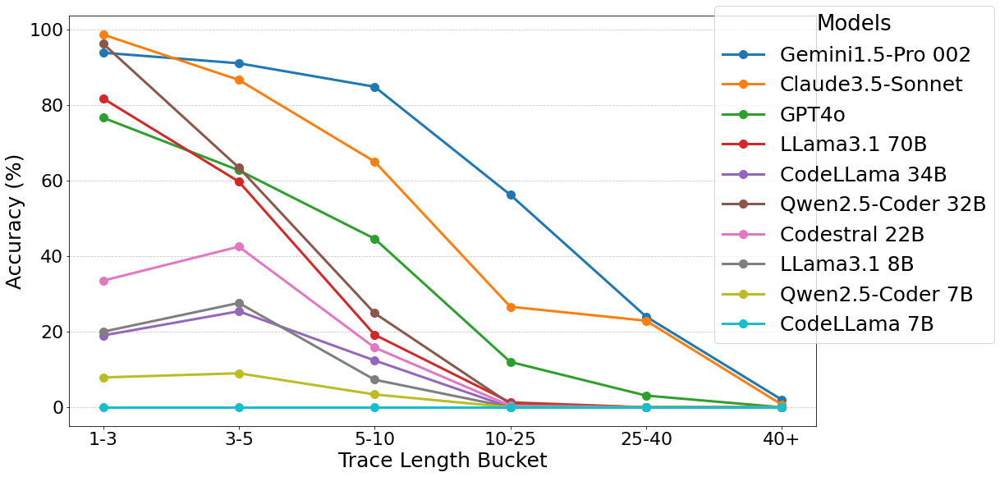

# CoCoNUT: Structural Code Understanding does not fall out of a tree
In this repository we investigate the capabilities of selected Large Language Models on understanding Structural Code Execution.
Namely, we consider the task of reproducing the code lines executed for a specific set of input arguments for a given function or a set of them.
This task is non-trivial due to a number of factors like recalling relevant parameter values, evaluating expressions, resolving method calls and keeping track of stacked executions.
In addition, we investigate the execution of advanced code concepts like OOP, Concurrency and Recursion. An example of one such task is displayed in the following:




This repository contains the different scripts we have used for generating and eliciting traces from Java and Python programs. The trace dataset is also shared at [HuggingFace](https://huggingface.co/datasets/ClaasBeger/CoCoNUT).

Under Dataset, we have saved the different short programs according to their respective functionality. In addition, this folder contains the majority of traces, as well as the code to produce them.  
The Results directory contains the traces produced by the different models and split between HumanEval and complex (e.g advanced concepts).
Models contains specific configuration files for different language models to run locally. Visualizations contains a number of basic visualizations of the different findings.


A basic overview of the findings on HumanEval can be found below:

The table below summarizes the performance of different models across tasks, evaluated using various metrics. Metrics are grouped under two evaluation settings: COT (Chain-of-Thought reasoning) and Direct.

### COT Evaluation

### Chain-of-Thought (CoT) Evaluation

| **Task ID**          | **Acc Hard (%)** | **Acc Mean (%)** | **Sim** | **False Sim** |
|-----------------------|------------------|------------------|---------|---------------|
| **Gemini1.5-Pro 002** | **47.2**        | **66.2**         | **0.88**| 0.37          |
| **Claude3.5-Sonnet**  | 41.0            | 61.6             | 0.87    | 0.43          |
| **GPT4o**             | 16.8            | 39.4             | 0.75    | 0.50          |
| **Qwen2.5-Coder 32B** | 26.1            | 44.3             | 0.81    | 0.50          |
| **LLama3.1 70B**      | 16.2            | 38.1             | 0.76    | 0.52          |
| **Codestral 22B**     | 9.3             | 25.0             | 0.71    | **0.57**      |
| **LLama3.1 8B**       | 1.9             | 12.6             | 0.56    | 0.51          |
| **Qwen2.5-Coder 7B**  | 1.9             | 11.0             | 0.61    | 0.56          |
| **CodeLLama 34B**     | 1.2             | 7.6              | 0.46    | 0.43          |
| **CodeLLama 7B**      | 0.0             | 0.1              | 0.28    | 0.28          |

### Direct Prompting Evaluation

| **Task ID**          | **Acc Hard (%)** | **Acc Mean (%)** | **Sim** | **False Sim** |
|-----------------------|------------------|------------------|---------|---------------|
| **Gemini1.5-Pro 002** | **47.0**        | **65.7**         | **0.89**| 0.37          |
| **Claude3.5-Sonnet**  | 41.0            | 58.7             | 0.88    | 0.44          |
| **GPT4o**             | 21.2            | 38.8             | 0.75    | 0.50          |
| **Qwen2.5-Coder 32B** | 32.7            | 42.4             | 0.78    | 0.44          |
| **LLama3.1 70B**      | 25.5            | 36.0             | 0.71    | 0.42          |
| **Codestral 22B**     | 3.1             | 17.8             | 0.66    | **0.59**      |
| **LLama3.1 8B**       | 0.6             | 10.4             | 0.53    | 0.48          |
| **Qwen2.5-Coder 7B**  | 0.0             | 4.1              | 0.56    | 0.55          |
| **CodeLLama 34B**     | 2.5             | 10.0             | 0.57    | 0.52          |
| **CodeLLama 7B**      | 0.0             | 0.0              | 0.41    | 0.41          |


### Explanation of Metrics:
- **Acc Hard (%)**: Accuracy for tasks that are traced correctly across all tests as a percentage.
- **Acc Mean (%)**: Mean accuracy across all tests of all examples as a percentage.
- **Sim**: Average overall similarity score between predictions and ground truth.
- **False Sim**: Similarity score based only on incorrect predictions.

We further investigated performance on advanced concepts:

### Task Performance (Advanced)

### Object-Oriented (40 Programs, 200 Traces)

| **Task ID**          | **CoT Acc Mean (%)** | **CoT Sim** | **Direct Acc Mean (%)** | **Direct Sim** |
|-----------------------|----------------------|-------------|-------------------------|----------------|
| **Gemini1.5-Pro 002** | 14.0                | 0.79        | **20.0**               | **0.81**       |
| **Claude3.5-Sonnet**  | 0.0                 | 0.77        | 1.0                    | 0.69           |
| **GPT4o**             | 4.5                 | **0.82**    | 4.0                    | 0.73           |
| **Qwen2.5-Coder 32B** | 14.5                | 0.78        | 4.0                    | 0.73           |
| **LLama3.1 70B**      | **15.0**            | 0.74        | 10.0                   | 0.75           |
| **Codestral 22B**     | 1.5                 | 0.62        | 1.5                    | 0.6            |
| **LLama3.1 8B**       | 0.5                 | 0.58        | 1.0                    | 0.48           |
| **Qwen2.5-Coder 7B**  | 0.0                 | 0.58        | 0.0                    | 0.56           |
| **CodeLLama 34B**     | 0.0                 | 0.37        | 0.0                    | 0.37           |
| **CodeLLama 7B**      | 0.0                 | 0.30        | 0.0                    | 0.40           |

### Recursion (66 Programs, 330 Traces)

| **Task ID**          | **CoT Acc Mean (%)** | **CoT Sim** | **Direct Acc Mean (%)** | **Direct Sim** |
|-----------------------|----------------------|-------------|-------------------------|----------------|
| **Gemini1.5-Pro 002** | 2.7                 | 0.47        | 0.9                    | **0.41**       |
| **Claude3.5-Sonnet**  | 0.3                 | 0.42        | 1.2                    | **0.41**       |
| **GPT4o**             | 2.7                 | **0.49**    | **1.8**                | 0.38           |
| **Qwen2.5-Coder 32B** | **3.0**             | 0.35        | **1.8**                | 0.30           |
| **LLama3.1 70B**      | 1.2                 | 0.36        | 0.6                    | 0.27           |
| **Codestral 22B**     | 1.0                 | 0.29        | 0.0                    | 0.29           |
| **LLama3.1 8B**       | 0.3                 | 0.21        | 0.0                    | 0.35           |
| **Qwen2.5-Coder 7B**  | 0.0                 | 0.15        | 0.0                    | 0.16           |
| **CodeLLama 34B**     | 0.0                 | 0.29        | 0.0                    | 0.27           |
| **CodeLLama 7B**      | 0.0                 | 0.23        | 0.0                    | 0.26           |

### Concurrency (20 Programs, 100 Traces)

| **Task ID**          | **CoT Acc Mean (%)** | **CoT Sim** | **Direct Acc Mean (%)** | **Direct Sim** |
|-----------------------|----------------------|-------------|-------------------------|----------------|
| **Gemini1.5-Pro 002** | **1.0**             | **0.41**    | **1.0**                | 0.39           |
| **Claude3.5-Sonnet**  | 0.0                 | 0.4         | 0.0                    | **0.42**       |
| **GPT4o**             | 0.0                 | 0.39        | 0.0                    | 0.4            |
| **Qwen2.5-Coder 32B** | 0.0                 | 0.36        | 0.0                    | 0.37           |
| **LLama3.1 70B**      | **1.0**             | 0.34        | **1.0**                | 0.33           |
| **Codestral 22B**     | 0.0                 | 0.29        | 0.0                    | 0.38           |
| **LLama3.1 8B**       | 0.0                 | 0.28        | 0.0                    | 0.26           |
| **Qwen2.5-Coder 7B**  | 0.0                 | 0.21        | 0.0                    | 0.18           |
| **CodeLLama 34B**     | 0.0                 | 0.24        | 0.0                    | 0.27           |
| **CodeLLama 7B**      | 0.0                 | 0.23        | 0.0                    | 0.28           |

### Task Performance using bucketed trace lengths



# Citation

```bibtex
@article{beger2025coconutstructuralcodeunderstanding,
  author        = {Beger, Claas and Dutta, Saikat},
  title         = {{CoCoNUT}: Structural Code Understanding Does Not Fall Out of a Tree},
  journal       = {arXiv preprint arXiv:2501.16456},
  year          = {2025},
  archivePrefix = {arXiv},
  eprint        = {2501.16456},
  primaryClass  = {cs.LG}
}
```

